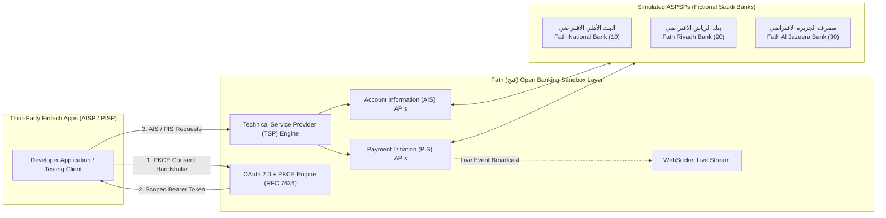

# Fath (فتح) | Saudi Open Banking Sandbox for Developers
### بيئة اختبار البنك المفتوح للمطورين

[](https://github.com/yamen-alwaily/fath/actions/workflows/tests.yml)
[](https://www.python.org/)
[](https://opensource.org/licenses/MIT)
[](https://www.sama.gov.sa/)

> **⚠️ Prominent Regulatory Disclaimer:**
> **Fath is an independent portfolio project for educational purposes. It is not affiliated with, endorsed by, or certified by SAMA (Saudi Central Bank). All bank names, account numbers, transactions, and financial data are fictional and generated for testing purposes only.**

---

## 🌟 Overview & Identity

The name **"Fath" (فتح)** means *"opening"* in Arabic: a direct linguistic and philosophical reference to **Open Banking**.

Fintech developers building in Saudi Arabia often encounter significant friction: accessing real bank sandbox environments requires extensive commercial agreements, institutional licensing, and lengthy compliance reviews. **Fath** bridges this gap by providing an open, self-hostable, zero-dependency Open Banking Sandbox simulating the **Saudi Central Bank (SAMA) Open Banking Framework Technical Standards v1.0**.

### Key Capabilities
- **Simulated ASPSPs (Banks)**: 3 fictional Saudi financial institutions with authentic naming and valid ISO 13616 / MOD-97 checksum-verified Saudi IBANs.
- **Pure-Python OAuth 2.0 + PKCE**: Zero external authentication libraries (no Authlib, no PyJWT). Cryptographically built from scratch using Python's standard library `secrets` and `hashlib`.
- **Account Information Services (AIS)**: RESTful endpoints for account lists, details, live balances, and paginated transaction ledgers.
- **Payment Initiation Services (PIS)**: Real-time payment orders with dynamic state transitions (`Pending` ➔ `Processing` ➔ `Completed` / `Rejected`) and ledger balance deductions.
- **Real-time WebSockets (SocketIO)**: Isolated per-user event rooms, live payment tracking, and an automated transaction simulator firing every 45 seconds.
- **Apple Human Interface Design**: Glassmorphic, bilingual (Arabic RTL & English LTR) developer portal and interactive API explorer.

---

## 🏛️ SAMA Framework Architecture & Roles

Fath implements the three regulatory participant roles defined in SAMA's Framework:



- **ASPSPs (Account Servicing Payment Service Providers)**: Simulated banks holding customer accounts and ledgers.
- **AISPs / PISPs**: Third-party fintech applications consuming open banking APIs.
- **TSP (Technical Service Provider)**: The infrastructure and abstraction layer provided by **Fath**.

---

## 👤 Synthetic Customer Archetypes

Fath seeds 8 months of realistic transactional history per customer, reflecting Saudi spending patterns, merchants, and payroll dates (the 27th of every Gregorian month):

| Archetype | Customer Name (AR / EN) | National ID | Financial Behavior | Balance Profile |
|---|---|---|---|---|
| **Prime** | عبدالله بن فهد التميمي<br/>*Abdullah Fahad Al-Tamimi* | `1084291840` | Aramco payroll, upscale dining, charity (*Ehsan*), multi-account investments. | SAR 180,000+ |
| **Average** | سارة بنت خالد الشمري<br/>*Sarah Khalid Al-Shammari* | `1047192834` | stc payroll, Tamimi groceries, HungerStation, Careem rides, balanced cashflow. | SAR 37,000+ |
| **Stressed** | محمد بن إبراهيم القحطاني<br/>*Mohammed Ibrahim Al-Qahtani* | `1092837461` | Irregular gig delivery credits, high rent burden (*Ejar*), frequent micro-expenses. | SAR 320 |
| **Flagged** | فيصل بن عبدالعزيز الدوسري<br/>*Faisal Abdulaziz Al-Dossary* | `1029384756` | Suspicious round-number transfers near reporting threshold (SAR 49,500), rapid dispersal. | Overdraft / Volatile |

---

## 🔒 OAuth 2.0 with PKCE Flow

Built strictly in standard Python (RFC 7636 & RFC 6749):

1. **Client sends `code_challenge`**: SHA-256 hash of `code_verifier`.
2. **Consent UI**: Customer approves or denies granular scopes (`accounts:read`, `balances:read`, `transactions:read`, `payments:write`).
3. **Single-Use Authorization Code**: Server issues short-lived single-use code (`secrets.token_urlsafe(32)`).
4. **Token Exchange**: Client sends `code` + `code_verifier`. Server verifies `SHA-256(code_verifier) == code_challenge` and issues a Bearer token valid for 1 hour.
5. **Replay Attack Mitigation**: If a consumed code is re-submitted, all tokens associated with the grant are revoked immediately.

---

## 🚀 API Endpoints Reference

### OAuth 2.0 & Consent
| Method | Endpoint | Description |
|---|---|---|
| `GET` / `POST` | `/oauth/authorize` | Authorization endpoint (renders UI or returns code) |
| `POST` | `/oauth/token` | Token exchange (`authorization_code` + `code_verifier`) |
| `POST` | `/oauth/revoke` | Token / Consent grant revocation |
| `GET` / `POST` | `/oauth/introspect` | RFC 7662 token introspection |

### Account Information Services (AIS)
| Method | Endpoint | Required Scope | Description |
|---|---|---|---|
| `GET` | `/open-banking/v1/accounts` | `accounts:read` | List all accounts for consented user |
| `GET` | `/open-banking/v1/accounts/{accountId}` | `accounts:read` | Account details (with user isolation) |
| `GET` | `/open-banking/v1/accounts/{accountId}/balances` | `balances:read` | Live available and booked balances |
| `GET` | `/open-banking/v1/accounts/{accountId}/transactions` | `transactions:read` | Transaction history with pagination |

### Payment Initiation Services (PIS)
| Method | Endpoint | Required Scope | Description |
|---|---|---|---|
| `POST` | `/open-banking/v1/payments` | `payments:write` | Initiate immediate payment and deduct balance |
| `GET` | `/open-banking/v1/payments/{paymentId}` | `payments:write` | Check payment execution status |

---

## 💻 Quick Start

### 1. Local Setup
```bash
# Clone repository
git clone https://github.com/yamen-alwaily/fath.git
cd fath

# Create virtual environment
python3 -m venv .venv
source .venv/bin/activate

# Install dependencies
pip install -r requirements.txt

# Seed demo data (8 months history)
python scripts/generate_demo_data.py --reset --months 8

# Launch application
python app.py
```
Open your browser at **[http://localhost:5000](http://localhost:5000)**.

### 2. Docker & Docker Compose
```bash
# Launch container with named persistent volume
docker compose up --build -d

# Verify service health
curl http://localhost:5000/health
```

### 3. Run Automated Tests
```bash
pytest -v tests/test_fath.py
```

---

## ⚡ cURL Example Walkthrough

```bash
# 1. Mint an Instant Sandbox Token via API Explorer or Token Endpoint
TOKEN=$(curl -s -X POST http://localhost:5000/portal/mint-token \
  -H "Content-Type: application/json" \
  -d '{"user_id": 1}' | grep -o '"access_token": *"[^"]*"' | cut -d'"' -f4)

# 2. Query Authorized Accounts
curl -X GET http://localhost:5000/open-banking/v1/accounts \
  -H "Authorization: Bearer $TOKEN"

# 3. Read Account Balances
curl -X GET http://localhost:5000/open-banking/v1/accounts/1/balances \
  -H "Authorization: Bearer $TOKEN"

# 4. Initiate an Instant Payment Order (PIS)
curl -X POST http://localhost:5000/open-banking/v1/payments \
  -H "Authorization: Bearer $TOKEN" \
  -H "Content-Type: application/json" \
  -d '{
    "fromAccountId": 1,
    "toIban": "SA7210000000000000001001",
    "amount": 250.00,
    "currency": "SAR",
    "reference": "Supplier Invoice #982"
  }'
```

---

## 📜 Citations & References
- **Saudi Central Bank (SAMA)**: *Open Banking Framework Technical Standards v1.0 (AIS & PIS Specifications)*
- **RFC 7636**: *Proof Key for Code Exchange by OAuth Public Clients (PKCE)*
- **RFC 6749**: *The OAuth 2.0 Authorization Framework*
- **ISO 13616**: *Financial Services: International Bank Account Number (IBAN)*

---

## 📄 License
This project is open-source under the [MIT License](LICENSE).
Created with pride by [Yamen Alwaily](https://github.com/yamen-alwaily).
